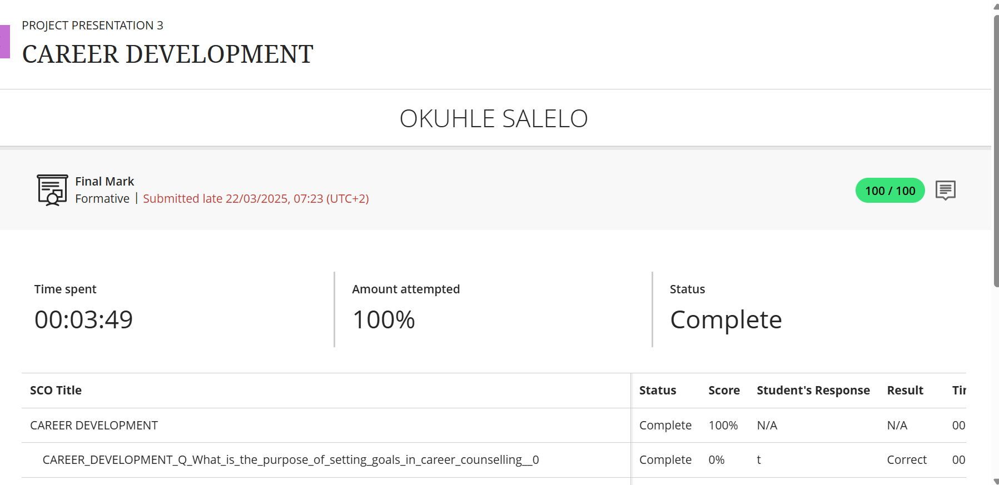

# Okuhle Salelo - Digital Portifolio
Hey,welcome to my digital portfolio. I am a passionate ICT: Communication Networking student at Cape Pensula University of Technology.This portfolio presents a collection of my career development activities, technical evidence, and personal growth experiences, with real evidence and Star-based refection.  And each section on this portfolio is aligned with the WIL preparation outcomes and showcases the knowledge and skills I have gained.

##Career Development

The Career Development course was straightfoward and helped me quickly graps the key concept of carrer planning, I was presented with the challenge of concept understanding and applying goal-setting and career planning as part of the module which was aimed at improving career readiness. My task was to learn how career counselling can effectively direct personal and proffessional growth by guideing individulas in the process of setting clear goals and making sound decisions about their future. Accordingly, I delved into the course materials deeply,  which contain the intention of goal setting, the results of carrer counselling, and methods of career plan development. I reflected over my own carrer dreams, defined clear, measurable objectives and set up the steps to reach the goals. I also noticed the importance of plan adjustment following the changes in the environment and the ability to be such a go getter to find learning opportunities. As a cosenquence, I got to know my carrer direction and the ways I need to go through confidently. I am more motivated now and I am willing and prepared to manage my career growth. As a netwroking student i did a research motivated by the course and I discovered that a common way used by proffessionals is to obtain IT certificates from big plaforms such as Cisco, CompTia, Oracle, and CISSP.

## Skills and Interest 

[Evidence](Skill.png)
**Reflection:** As part of the Skills and Interest course, I participated in a session that examined my values,interest, and skills which are essential components that influence both proffessional and personal growth. I was given the definitions of each. Values are ideas ad principles that direct my decisions, and Interest are the pursuits I find enjoyable or passionate about, then Skills are the abilities I have acquired through education and experience. I discovered from the guided questions that transferable skills, like teamwork, communication and problem-solving are crucial for long term sucess because they can be used in a variety of proffessions and sectors. I also considete how my personal values which are honesty and service to others have an important influence on my proffessional objectives. These values guide the way I approach my career, especially in the field of ICT and technical support, where trust, integrity, confidentiality and a commitiment to helping clients are essential. In keeping with these values, I hope to establish solid moral bonds with clients, cooworkers and offer dependable, person centered assistance that supports my objective of making positive contributions to network and communication system in work settings.

## Personality Assesment
[Evidence](P)
**Reflection:** As part of the Personality Assesment course, I took a look at the way individual personality traits can effect career choices and employment satisfaction. The principal goal of personality and career  matching is to associate  one's characteristics, inclinations, and working style with the jobs that most fit them, consequently resulting in higher motivation and performance. During the course, I was taught  about some personality types like Realistic, which comes out as out as a very common one related with hands-on, practical careers like engineering or technical fileds.I also gained the fact that the Artistic personality type is cooperative with creating jobs which emphasize self expression, such as design, writing or the arts. Through certain questions that were asked in the course, It was clear that some of those creative, data-driven and deductive individuals who prefer working with data, facts, and ideas in a systematic and analytical way typically relate to the investigative personality type. I also found out that a person whise code preference is mostly a Conventional will find it easier to get very competent in structured careers like system analysis or accounting, and data management. Through this period of self reflection, I was able to understand the influence of my own personality traits on my carrer path better, and this has pushed me to think about the best career options that fit my personal skills ans interests.

## Create a CV

As part of the Create a CV course, I was required to write a polished resume. My goal was to create an engending,well organized resume that sucessfully showcased my training, abilities, and experiences while also meeting the requirements of possible employers. I did this by following the CV writing instructions that were taught in the course.I added optinal sections,like contact details, education, and work history. I used powerful action verbs, paid great attention to formatting, and wrote straightfoward descriptions. I carefully checked the document for errors and ensuring the structure and tone where appropriate for the IT networking industry. As a result of the content covered in the **Create a CV** course i was able to create a CV which makes me seem like an outstanding and competitive applicant. Knowing that my resume communicated my skills and abilities has given me greater confidence when i apply for interships and jobs. The course has also instructed that a good practise is to have two references.
[Evidence](Create.png)

## CV Submission
**Reflection:** This portifolio shows a detailed representation of my accademical achievements,technical skills, and professional growth as a student porsuing Diploma in ICT:Communication Networking. The detailed resume not only lists my accademical achivements but also shows my quest of knowledge in the area and my Consistent proffessional growth over the years.
And as stated in the CV I am currently an intern at BankSeta in the support team, I am developing my problem-solving, collaborative, and proffessional communication skills in the intership.
Additional,my devotion to learning and gaining new knowledge has been confirmed by Google IT Suport Professional Certificate, UX Design training, and Ethical Hacking certification from LinkedIn. These courses open new horizons in my understanding of IT support,userexperience principles, and cybersecurity,enabling me to be in line with technology development in an effecient manner.
The inclusion of both the Original word ducument and converted to PDF version, when i was converting my CV for sumission, I ensured the formating remained consistent and proffessional, reflecting my comitment and quality.
