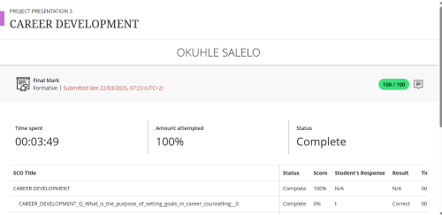
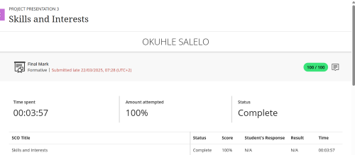
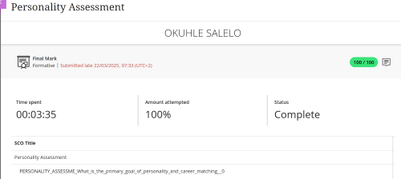
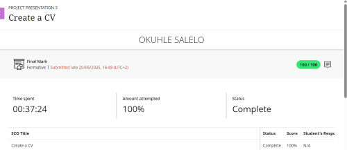
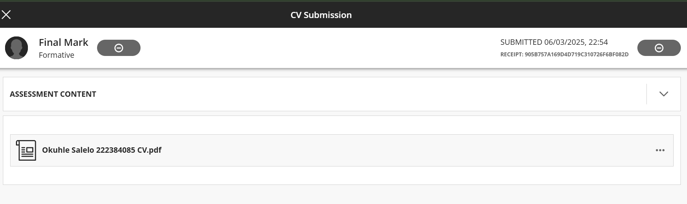
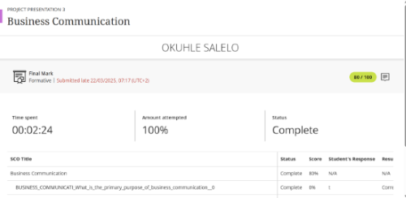
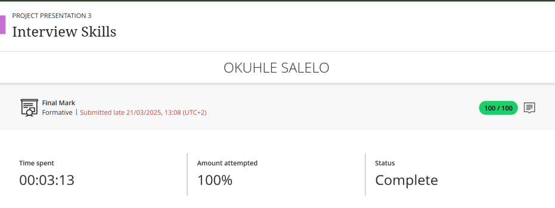
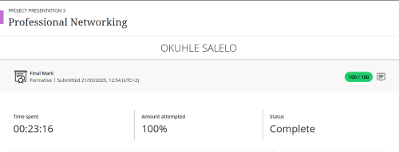
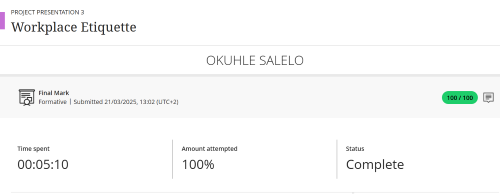

# Okuhle Salelo - Digital Portifolio

 - Hey,welcome to my digital portfolio. I am a passionate ICT: Communication Networking student at Cape Pensula University of Technology. This portfolio presents a comprehensive collection of my career development activities, technical evidence, and personal growth experiences, supported by authentic evidence and Star-based refections. Each section in this portfolio is aligned with the Work Intergrated Learning (WIL) preparation outcomes and demonstrates the knowledge and skills I have developed throughout the program.

   ### This Digital portfolio includes:
  
    - Career Development  📚👩‍💻 🌱
    - Skills and Interests 💻🖱️
    - Personality Asssesment💬🔍
    - Creeating a CV 📃🖋️
    - Bussiness Communication 🗨️📧🗣️
    - Interview Skills 👨‍💼🔰
    - Professional Networking 🤝🌐
    - Workplace Etiquette 🏢💼👩‍💻
    
                       
                              
## Career Development

   >The Screenshoot above is  evidence of the Career Development course completion. ✅

My **Reflection** on the Career Development course was straightfoward and helped me quickly graps the key concept of carrer planning. I was presented with the challenge of concept understanding and applying goal-setting and career planning as part of the module which was aimed at improving career readiness. My task was to learn how career counselling can effectively direct personal and proffessional growth by guideing individulas in the process of setting clear goals and making sound decisions about their future. Accordingly, I delved into the course materials deeply,  which contain the intention of goal setting, the results of carrer counselling, and methods of career plan development. I reflected over my own carrer dreams, defined clear, measurable objectives and set up the steps to reach the goals. I also noticed the importance of plan adjustment following the changes in the environment and the ability to be such a go getter to find learning opportunities. As a cosenquence, I got to know my carrer direction and the ways I need to go through confidently. I am more motivated now and I am willing and prepared to manage my career growth. As a netwroking student i did a research motivated by the course and I discovered that a common way used by proffessionals is to obtain IT certificates from big plaforms such as Cisco, CompTia, Oracle, and CISSP.

## Skills and Interest 

**Reflection:** As part of the Skills and Interest course, I participated in a session that examined my values,interest, and skills which are essential components that influence both proffessional and personal growth. I was given the definitions of each. Values are ideas ad principles that direct my decisions, and Interest are the pursuits i find enjoyable or passionate about, then Skills are the abilities i have acquired through education and experience. I discovered from the guided questions that transferable skills, like teamwork, communication and problem-solving are crucial for long term sucess because they can be used in a variety of proffessions and sectors. I also considete how my personal values which are honesty and service to others have an important influence on my proffessional objectives. These values guide the way i approach my career, especially in the field of ICT and technical support, where trust, integrity, confidentiality and a commitiment to helping clients are essential. In keeping with these values, i hope to establish solid moral bonds with clients, cooworkers and offer dependable, person centered assistance that supports my objective of making positive contributions to network and communication system in work settings.

## Personality Assesment

**Reflection:**   As part of the Personality Assesment course, I took a look at the way individual personality traits can effect career choices and employment satisfaction. The principal goal of personality and career  matching is to associate  one's characteristics, inclinations, and working style with the jobs that most fit them, consequently resulting in higher motivation and performance. During the course, I was taught  about some personality types like Realistic, which comes out as out as a very common one related with hands-on, practical careers like engineering or technical fileds. I also gained the fact that the Artistic personality type is cooperative with creating jobs which emphasize self expression, such as design, writing or the arts. Through certain questions that were asked in the course, It was clear that some of those creative, data-driven and deductive individuals who prefer working with data, facts, and ideas in a systematic and analytical way typically relate to the investigative personality type. I also found out that a person whise code preference is mostly a Conventional will find it easier to get very competent in structured careers like system analysis or accounting, and data management. Through this period of self reflection, I was able to understand the influence of my own personality traits on my carrer path better, and this has pushed me to think about the best career options that fit my personal skills ans interests.

 
>Above is the evidence for Pesonality Assesment

## Create a CV 

   > As part of the Create a CV course, I was required to write a polished resume. My goal was to create an engending,well organized resume that sucessfully showcased my training, abilities, and experiences while also meeting the requirements of possible employers. I did this by following the CV writing instructions that were taught in the course.I added optinal sections,like contact details, education, and work history. I used powerful action verbs, paid great attention to formatting, and wrote straightfoward descriptions. I carefully checked the document for errors and ensuring the structure and tone where appropriate for the IT networking industry. As a result of the content covered in the **Create a CV** course i was able to create a CV which makes me seem like an outstanding and competitive applicant. Knowing that my resume communicated my skills and abilities has given me greater confidence when i apply for interships and jobs. The course has also instructed that a good practise is to have two references.

## CV Submission
**Reflection:** This portifolio shows a detailed representation of my accademical achievements,technical skills, and professional growth as a student porsuing Diploma in ICT:Communication Networking. The detailed resume not only lists my accademical achivements but also shows my quest of knowledge in the area and my Consistent proffessional growth over the years.
And as stated in the CV I am currently an intern at BankSeta in the support team, I am developing my problem-solving, collaborative, and proffessional communication skills in the intership.
Additional,my devotion to learning and gaining new knowledge has been confirmed by Google IT Suport Professional Certificate, UX Design training, and Ethical Hacking certification from LinkedIn. These courses open new horizons in my understanding of IT support,userexperience principles, and cybersecurity,enabling me to be in line with technology development in an effecient manner.
The inclusion of both the Original word ducument and converted to PDF version, when i was converting my CV for sumission, I ensured the formating remained consistent and proffessional, reflecting my comitment and quality.

>[!Important]
>You can review my CV📃 here [HERE](WordCV.docx)

 ## Business Communication

Reflection:  As part of the **Business Communication** course, I was given an online activity which served as an assessment of my knowlwdge regarding communication principles in a proffessional environment. The primary objectives were to explore the reasons for, and the significant of, effective business communication, identify different means of communication, and also, demonstrate the coerrect use of etiquette in various situations. To do this I answered a series of questions which touched on verbal and non-verbal communication, correct email tone, and professional behavior in virtual meetings. I considered each question diligently, thinking about how the chosen tone, level of formality, and manners used affected the professionalism.

For example, I accurately recognized the instances of non-verbal communication and the business email tone but realized that i neede to strengthen my knowledge of formal language usage in business communication. Therefore, I obtained an overall score of 80%, which indicates that i have a good understanding of the main concepts and at the same time, identifies the points where i need to deepen my knowldge. Through this exercise, I realied that effective communication means not only what is said but also the manner in which it is expressed. Additionally, it confirmed the indispensability of proffessionalism and clarity in every interaction taking place in the workplace.

## Interview Skills
   
   
   
- Reflection:
                                                             
One of the activities in the **Interview Skills** course was to learn and apply the key concepts that would make the candidate a sucessful interviewee. Basically, this job was about me going through real-world scenerio roles and figuring out what would be my best reactions to common interview questions in a confident and proffectional manner.

Firstly, I went through the reasons behind interviews and why it is very important to get to know the company before an interview, and also found out the **CAR**( Content,Action, Result) formula as one of the most used to structure effective answers. By using the methosa given, i finished the quiz with a perfect score, which is a clear indication of my through comprehension of the principles of a job interview. This workshop was a great confidence booster for me as i learned how to express my ideas clearly, demonstrate my strngths, and talk about my weeknesses in a frindly way. Now , i am convinced that i can handle the next interview with the right mix of professionalism, being reue to my self, and being well prepared.

## Mock interview

 **Reflection**: As part of the interview preparation module, I participated in a mock interview where I was required to record and submit a video of myself responding to common interview questions.The main objective of this exercise was to practise my communication, presentation, and critical thinking skills in a simulated professional setting. Recording the video also helped me identify areas of improvement, such as maintaining better eye contact and minimizing filler words. Through this activity, I gained valuable experince in presenting myself proffessionally and answering questions with clarity anf confidence.

This reflection helped me recognize how continous practice and self-assesment can significantly improve my real lifr interview perfomance and readiness for future job opportuities.

> 📝**Note:**
> This video below is my submission for the *Mock Interview* activity.
> 
>  📹 [Watch the Mock Interview Video](vid.mp4)

 
 ## Proffessional Networking

While i was taking the  **Professional Networking** course, one of my assignments was to figure out how important it is to develop and keep up professional relationships that will help my carrer to grow and open up new opportunities. The objective of the exercise was to learn how to establish significant relationships, to be able to talk effectively in professional environments, and to know how to behave correclty when networking in different places.

I examined during the lessin the reasons for professional networking, what is meant by a networking event, and which ways of behaivior to avoid while meeting new professionals. Iwas also informed about the golden networking rule that focuses on offering something before expecting anything in return and the significance of being the one to make first move in establishing a network.
I had the chance to put in practise these networking principles by going through the content, thinking about how i communicate, and then doing the quiz. In this way,  I got a score of **100%* which is an indicator of my proficiency in using networking for the growth of my proffessional relationships. I can say that this exercise made me aware of the fact tha successful networking is not just about using it as a ladder for a carrer progress. 

I am now more able to attend networking events without hesitation, to present mystelf in a proffectional manner, and to be able to keep in touch with people with whom I share the same ICT carrer goals and thus create meaningful relationships.

  

 >Above is the Evidence for Proffessional Networking

## Workplace Etiquette
As part of the **Workplace etiquette** course, I have to learn to keep professionalism, respect, and proper behavior in the work environment. The target of this assignment was to acquire appropriate work conduct, communication patternes, and company values that lead to a pleasant and efficient atmosphere.

In the session, I was introduced to the main ideas of managing confidential information in a responsible manner, keeping proffetional communication via email, and realizing the importance of being on time for meetings. In addition, I was informed about the proper methods of using pesonal devices during work hours and the right way to ask for time off or an early leave for personal reasons. All these ideas emplasized the significance of professionalism, self-desciplene, and respect for both collegues and workplace rules.

By the prident implementation of the concepts delivered in the module i was able to attain a perfect score of **100%** on the assesment, this demonstrating a thorough understanding of workplace ethics and behavior expectations.
This experience helped me realize more deply how proffessionalism and good manners have a great impact on one's image eqquiped to show out these good traits namely,**trustworthiness**, **repect**,and **honesty**, in the world of work , which are very important characters in the IT sector.

> Below is the evidence Workplace Etiquette

